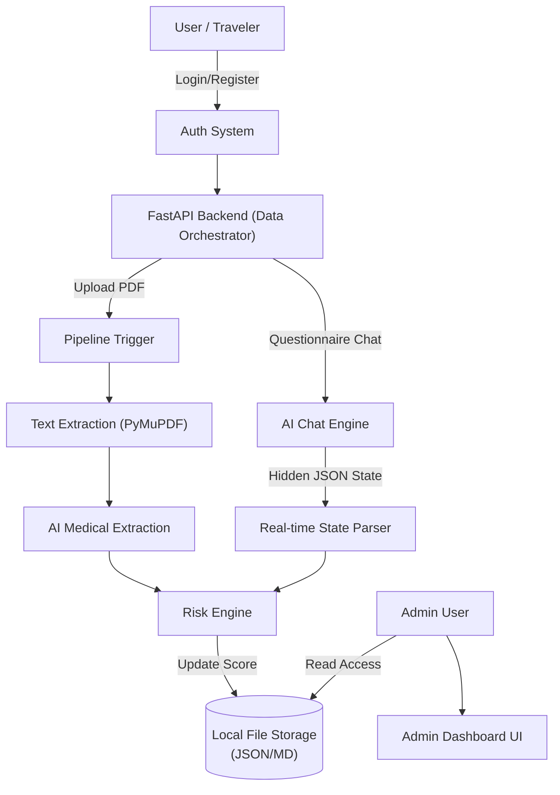

# Molsys Airport Health Intelligence System

An AI-native medical screening platform designed for rapid health assessment, automated risk scoring, and clinical intelligence at travel checkpoints. The system leverages state-of-the-art Large Language Models (LLMs) to automatically process medical PDFs, conduct real-time health screenings, and flag high-risk individuals for administrative review using a highly deterministic risk scoring algorithm.

---

## 🌟 Key Features

### 1. Automated Medical Data Extraction Pipeline
Upload any medical PDF (e.g., blood reports, discharge summaries) and the AI pipeline will:
- Extract text accurately without external OCR services.
- Understand medical jargon and extract a strictly typed JSON profile containing **Exposure History**, **Active Symptoms**, **Vitals**, and **Critical Lab Markers** (Platelets, WBC, CRP, etc.).
- Auto-generate a **Clinical Summary** for medical professionals.
- Auto-generate an **Airport Screening Summary** focused purely on travel fitness and contagion risk.

### 2. Deterministic Risk Engine
Every action triggers the real-time Risk Engine which evaluates the patient's data against strict medical protocols and generates a `0-100` Risk Score and a Risk Level:
- 🟢 **LOW (0-25)** - Cleared for travel
- 🟡 **MODERATE (26-50)** - Health advisory issued
- 🟠 **HIGH (51-75)** - Medical clearance required
- 🔴 **CRITICAL (76-100)** - Immediate attention needed (e.g. Unexplained bleeding combined with high-risk travel instantly triggers a 100 score).

### 3. AI-Guided Health Questionnaire
A conversational health screening questionnaire that tracks symptoms dynamically. 
- Real-time silent extraction of symptoms during the chat.
- Live updating of the patient's risk profile in the database without waiting for the chat to complete.
- The AI is strictly instructed to act as an airport triage agent, asking questions one-by-one to prevent overwhelming the traveler.

### 4. Comprehensive Admin Dashboard
Administrative staff can monitor the entire traveler population from a centralized command center.
- Top-level analytics showing total patients categorized by risk level.
- Complete access to patient histories, uploaded files, structured data tables, AI-generated summaries, and raw questionnaire logs.
- Searchable patient database with one-click access to detailed medical timelines.

---

## 🏗️ Architecture Flow



---

## 📁 Detailed Project Structure & File Guide

```text
Molsys_Summarizer/
├── backend/
│   ├── api/
│   │   ├── auth.py              # JWT Auth, registration, admin checking
│   │   ├── chat_store.py        # Manages conversational chat histories
│   │   ├── jobs.py              # In-memory async job tracker
│   │   └── patient_store.py     # Critical DB layer: Saves, merges, and updates JSON/MD patient records
│   ├── summarizer/
│   │   ├── medical_pipeline.py  # Orchestrates full pipeline: PDF -> JSON -> Summaries -> Save
│   │   ├── nvidia_client.py     # AI Engine: Prompts, schemas, & Lightning/NVIDIA API clients
│   │   ├── pdf_processor.py     # PyMuPDF engine to extract raw text blocks from PDFs
│   │   └── risk_engine.py       # Deterministic rules engine to calculate 0-100 Risk Score
│   └── main.py                  # FastAPI entry point, defining all REST endpoints
├── frontend/
│   ├── src/
│   │   ├── components/          # Reusable UI widgets (Chat bubbles, Sidebar, etc.)
│   │   ├── pages/
│   │   │   ├── AdminPage.jsx        # Command center for admins (lists all users)
│   │   │   ├── DashboardPage.jsx    # User landing page with risk score
│   │   │   ├── LoginPage.jsx        # Authentication (Login)
│   │   │   ├── PatientPage.jsx      # Detailed medical record dashboard for the user
│   │   │   ├── QuestionnairePage.jsx# Interactive AI health triage chat
│   │   │   ├── RegisterPage.jsx     # Authentication (Sign up)
│   │   │   └── UploadPage.jsx       # Drag-and-drop PDF pipeline trigger
│   │   ├── App.jsx              # React Router setup
│   │   └── index.css            # Custom styling, dark-mode colors, glassmorphism UI
│   ├── package.json             # React/Vite dependencies
│   └── vite.config.js           # Vite server configuration
├── data/                        # Local file-based storage (Auto-generated)
│   ├── users.json               # Credentials database
│   └── patients/                # Per-user isolated folders containing all JSONs/MDs
└── README.md                    # Project documentation
```

### Backend (FastAPI / Python)
The backend orchestrates all data flows, authentication, and LLM processing.

- `backend/main.py`
  **Core Application:** The main FastAPI server. Defines all REST endpoints (`/api/auth`, `/api/upload`, `/api/questionnaire`, `/api/admin`, etc.).

- `backend/api/`
  - `auth.py`: Handles JWT generation, password hashing, user registration, and Admin verification.
  - `patient_store.py`: **Critical Data Layer.** Manages the structured file system. Saves patient profiles, merges new medical extractions deterministically (using logical ORs for booleans), and generates markdown records.
  - `chat_store.py`: Manages the saving and retrieving of general chat histories.
  - `jobs.py`: Simple in-memory tracker for long-running asynchronous tasks (like PDF extraction pipelines).

- `backend/summarizer/`
  - `nvidia_client.py`: **AI Brain.** Contains the dual-provider LLM routing logic (NVIDIA NIM and Lightning AI). Holds all the strict system prompts (`MEDICAL_EXTRACTION_PROMPT`, `QUESTIONNAIRE_SYSTEM_PROMPT`) that enforce the anti-hallucination JSON schema.
  - `risk_engine.py`: **Clinical Rules Engine.** Takes extracted medical JSON and applies deterministic math rules (symptom penalties, lab thresholds, base multipliers) to output a 0-100 risk score and travel recommendations.
  - `medical_pipeline.py`: Orchestrates the step-by-step pipeline: takes raw text -> calls LLM for extraction -> calls LLM for clinical summary -> calls LLM for airport summary.
  - `pdf_processor.py`: Uses PyMuPDF to extract clean text blocks from uploaded medical files.

### Frontend (React / Vite)
A modern, responsive Single Page Application (SPA) utilizing a custom dark-mode aesthetic with glassmorphism components.

- `frontend/src/pages/`
  - `DashboardPage.jsx`: The main landing page for travelers. Shows their current overall risk score, recent updates, and a Risk Score Legend.
  - `UploadPage.jsx`: Drag-and-drop interface for medical PDFs. Includes a real-time progress tracker and instantly displays the extracted risk breakdown and AI summaries once the pipeline finishes.
  - `QuestionnairePage.jsx`: A real-time chat interface where the AI triage agent screens the traveler.
  - `PatientPage.jsx`: A comprehensive medical record dashboard for the individual traveler showing their full timeline, parsed questionnaire data, and risk breakdowns.
  - `AdminPage.jsx`: **Command Center.** An admin-exclusive view listing all users sorted by risk. Allows the admin to click into any user and view their complete medical timeline, extracted data tables, and raw PDFs.
  - `AuthPage.jsx` / `LoginPage.jsx` / `RegisterPage.jsx`: Standard authentication flows.

- `frontend/src/App.jsx`: Main React router configuring public and protected routes.
- `frontend/src/index.css`: Contains all the custom CSS variables, styling for risk badges (`.LOW`, `.CRITICAL`), animations, and layout grids.

### Data Storage (`data/`)
The system uses a completely localized JSON/MD file storage system. No external database is required.

- `data/users.json`: Holds username and password hashes.
- `data/patients/{username}/`:
  - `profile.json`: Top-level patient demographics and aggregated conditions.
  - `timeline/timeline.json`: A chronological ledger of every action the patient took (uploads, chats, etc.).
  - `extracted/`: Contains the raw `extraction.json` and human-readable `extracted.md`.
  - `summaries/`: Contains the LLM-generated clinical and airport markdown summaries.
  - `uploads/`: Stores the raw uploaded PDF files for admin verification.

---

## 🚀 Setup & Installation

### Prerequisites
- Python 3.10+
- Node.js 18+

### 1. Start the Backend
Navigate to the root directory and start the FastAPI server:

```bash
# Install dependencies
pip install fastapi uvicorn pydantic python-multipart PyMuPDF openai requests

# Set API Keys
set LIGHTNING_API_KEY=your_key_here

# Run the server
python -m uvicorn backend.main:app --reload
```

### 2. Start the Frontend
Open a new terminal and navigate to the `frontend` directory:

```bash
cd frontend

# Install dependencies
npm install

# Start development server
npm run dev
```

### 3. Access the Application
- **Frontend URL:** `http://localhost:5173`
- **Backend API Docs:** `http://localhost:8000/docs`

**Default Admin Credentials:**
- Username: `admin`
- Password: `admin123`

*(Note: Admin accounts can view all patient records on the Admin Dashboard, standard users can only view their own).*
